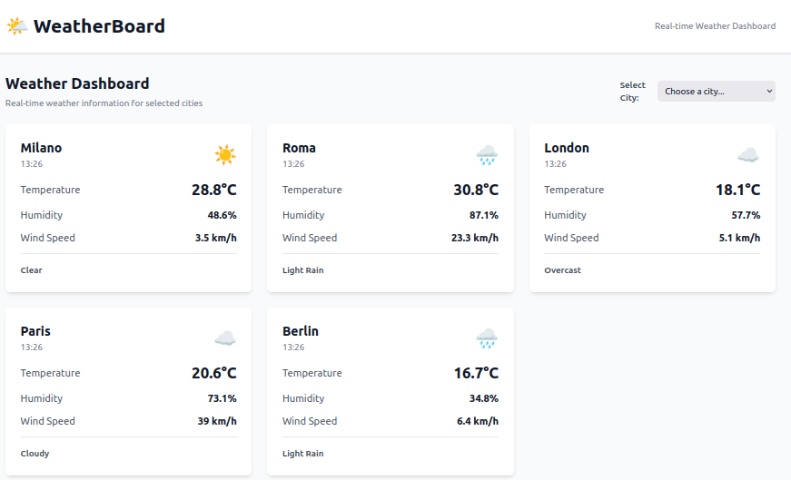

# 🌤️ WeatherBoard


_Example of WeatherBoard dashboard in action_

**WeatherBoard** is a fullstack project for real-time weather data visualization through a modern React dashboard and a FastAPI backend.  
The data source can be chosen between simulated (mock) data or real data via MQTT (e.g., from an external simulator).

---

> 📖 **See also:** [Integration & Data Source Switch Guide (Mock/MQTT)](docs/INTEGRATION.md)

---

## 🚀 Quick Start

### Using the start script (recommended)
```bash
# Start in mock mode (default)
./start.sh

# Start in MQTT mode
./start.sh mqtt

# Stop all services
./stop.sh
```

### Manual start
See detailed instructions below.

---

## 🧱 Architecture Overview

```
weatherboard/
├── frontend/        # React + Vite + Zustand + Tailwind
├── backend/         # FastAPI with mock/MQTT data source switch
├── .github/         # GitHub Actions CI pipelines
├── community/       # CONTRIBUTING, LICENSE, etc.
└── docs/            # Documentation and assets
```

---

## 🔹 Operating Modes

WeatherBoard backend can be started in two modes:

- **Mock**: generates random data on each request (default, ideal for development and testing)
- **MQTT**: subscribes to an MQTT broker and serves real-time data received (integration with simulators or real sensors)

The mode is selected via the `DATA_SOURCE` environment variable:

```bash
# Mock mode (default)
DATA_SOURCE=mock

# MQTT mode
DATA_SOURCE=mqtt
MQTT_BROKER_HOST=localhost
MQTT_BROKER_PORT=1883
```

---

## 📜 Usage

### 🖥️ Frontend
```bash
cd frontend
npm install
npm run dev
# Open http://localhost:5173 in your browser
```

### 🐍 Backend
```bash
cd backend
pip install -r requirements.txt
# Start in mock mode (default)
uvicorn app.main:app --reload --port 8000 --host 0.0.0.0
# Start in MQTT mode
DATA_SOURCE=mqtt MQTT_BROKER_HOST=localhost MQTT_BROKER_PORT=1883 uvicorn app.main:app --reload --port 8000 --host 0.0.0.0
```

---

## 📡 Data Simulation and MQTT Integration

WeatherBoard can receive real-time data from any compatible MQTT broker.
To test the dashboard with simulated data, you can use an [MQTT Simulator](https://github.com/your-user/mqtt-simulator) (separate open source project).

### Example local setup

1. Start Mosquitto (MQTT broker):
   ```bash
   docker run -it -p 1883:1883 eclipse-mosquitto
   ```
2. Start the MQTT simulator:
   ```bash
   python -m mqtt_simulator.cli --profile weather --broker localhost --interval 2
   ```
3. Start the WeatherBoard backend (in MQTT mode):
   ```bash
   DATA_SOURCE=mqtt MQTT_BROKER_HOST=localhost MQTT_BROKER_PORT=1883 uvicorn app.main:app --reload --port 8000 --host 0.0.0.0
   ```
4. Start the frontend and view the dashboard!

---

## 🟢 API Response Structure

All API endpoints return a standardized response object. Example for `/api/v1/weather`:

```json
{
  "success": true,
  "data": [
    {
      "city": "Milano",
      "temperature": 18.3,
      "humidity": 65.5,
      "wind_speed": 10.4,
      "description": "Heavy Rain",
      "timestamp": "2024-07-03T11:34:00Z"
    }
  ],
  "error": null
}
```

- For single city: `data` is an object, for all cities: `data` is a list.
- On error: `success` is `false` and `error` contains the message.

---

## 🩺 Health Check

A health check endpoint is available at:
```
GET /health
```
Returns backend status and, if in MQTT mode, MQTT connection info.

---

## ✅ Community Standards

This project follows open source standards:
- [x] [LICENSE](community/LICENSE) (MIT)
- [x] [CONTRIBUTING.md](community/CONTRIBUTING.md)
- [x] [CODE_OF_CONDUCT.md](community/CODE_OF_CONDUCT.md)
- [x] [SECURITY.md](community/SECURITY.md)

---

## 🤖 AI Development

The backend is designed to be AI-friendly (Cursor, Copilot) and easily extendable with new data sources.

---

## 🧪 Tests

- Frontend: `npm run test`
- Backend: `pytest`

---

## ⚠️ Error Handling

The dashboard displays errors in a user-friendly way via toast notifications in the top-right corner.

---

## 🛡️ License

MIT — see [LICENSE](community/LICENSE) for details.
